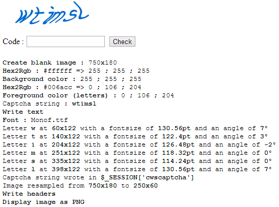

[](https://packagist.org/packages/crazy-max/cws-captcha)
[](https://php.net/)
[](https://travis-ci.com/crazy-max/CwsCaptcha)
[](https://www.codacy.com/app/crazy-max/CwsCaptcha)
[](https://www.patreon.com/crazymax)
[](https://www.paypal.me/crazyws)

## About

PHP class to generate a captcha to avoid spam.

## Installation

```bash
composer require crazy-max/cws-captcha
```

And download the code:

```bash
composer install # or update
```

## Getting started

See `tests/test.php`, `tests/testCaptcha.php` files samples to help you.

To create a captcha, copy/edit `testCaptcha.php` file and insert this in your HTML :

```html

```

## Example



## Methods

**process** - Process the captcha generation.<br />
**check** - Static method that checks the captcha code entered.<br />

**getWidth** - Captcha width in px.<br />
**setWidth** - Set the captcha width in px.<br />
**getHeight** - Captcha height in px.<br />
**setHeight** - Set the captcha height in px.<br />
**getMinLength** - Captcha minimum length.<br />
**setMinLength** - Set the captcha minimum length.<br />
**getMaxLength** - Captcha maximum length.<br />
**setMaxLength** - Set the captcha maximum length.<br />
**getBgdColor** - Hexadecimal background color.<br />
**setBgdColor** - Set the hexadecimal background color.<br />
**getBgdTransparent** - The background transparent for PNG image type.<br />
**setBgdTransparent** - Set background transparent for PNG image type. If enabled, this will disable the background color.<br />
**getFgdColors** - Hexadecimal foreground colors list for font letters.<br />
**setFgdColors** - Set the Hexadecimal foreground colors list for font letters.<br />
**getFonts** - Fonts definition (letter_space, min and max size, filename).<br />
**getMaxRotation** - Max clockwise rotations for a letter.<br />
**setMaxRotation** - Set the max clockwise rotations for a letter.<br />
**getPeriod** - Generated image period (x, y).<br />
**setPeriod** - Set the generated image period (x, y).<br />
**getAmplitude** - Generated image amplitude (x, y).<br />
**setAmplitude** - Set the generated image amplitude (x, y).<br />
**getBlur** - The blur effect using the Gaussian method.<br />
**setBlur** - Add blur effect using the Gaussian method.<br />
**getEmboss** - The emboss effect.<br />
**setEmboss** - Add emboss effect.<br />
**getPixelate** - The pixelate effect.<br />
**setPixelate** - Add pixelate effect.<br />
**getFormat** - Image format.<br />
**setPngFormat** - Set the png image format. (default)<br />
**setJpegFormat** - Set the jpeg image format.<br />
**getError** - The last error.<br />

## How can I help ?

All kinds of contributions are welcome :raised_hands:!<br />
The most basic way to show your support is to star :star2: the project, or to raise issues :speech_balloon:<br />
But we're not gonna lie to each other, I'd rather you buy me a beer or two :beers:!

[](https://www.patreon.com/crazymax) 
[](https://www.paypal.me/crazyws)

## License

MIT. See `LICENSE` for more details.
